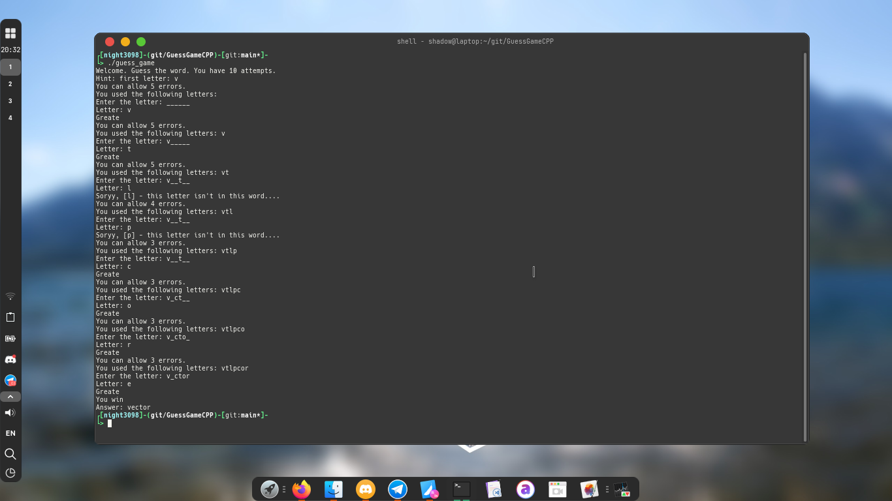

# GuessGameCPP

<h2>A simple word guessing game in c++</h2>
<p align="center">


<p align="center"></p>

<hr>

```
git clone https://github.com/night3098/GuessGameCPP
cd GuessGameCPP
```

# Сompilation

`c++ -x c++ -o guess_game guess_game.cpp`

# Start

`./guess_game.cpp`
